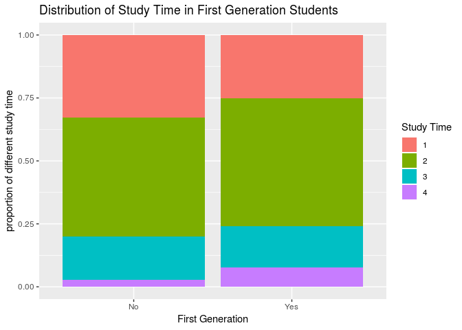

PROJECT TITLE
================
LAW students
Mar. 29th

### Load packages

``` r
library(tidyverse) 
library(broom)
library(infer)
```

### Load data

``` r
students <- read_csv("/cloud/project/proposal/student-mat.csv")
```

## Section 1. Introduction

## Section 2. Data analysis plan

``` r
students <- students %>%
  mutate(first_gen = case_when(
    Medu < 4 ~ "Yes",
    Fedu < 4 ~ "Yes",
    Medu == 4 ~ "No",
    Fedu == 4 ~ "No"))
students %>%
  count(first_gen)
```

    ## # A tibble: 2 x 2
    ##   first_gen     n
    ##   <chr>     <int>
    ## 1 No           70
    ## 2 Yes         325

``` r
students <- students %>%
  mutate(avg_score = ((G1 + G2 + G3)/3))
```

``` r
full_model <- lm(avg_score ~ school + 
                  sex + age + address + 
                  famsize + Pstatus + 
                   Mjob + Fjob + 
                  reason + guardian + traveltime +
                  studytime + failures + 
                  paid + activities +
                  nursery + higher + internet +
                  romantic + famrel + freetime +
                  goout + Dalc + Walc +
                  health + absences + first_gen, data = students)
final_model <- step(full_model, direction = "backward")
```

    ## Start:  AIC=978.28
    ## avg_score ~ school + sex + age + address + famsize + Pstatus + 
    ##     Mjob + Fjob + reason + guardian + traveltime + studytime + 
    ##     failures + paid + activities + nursery + higher + internet + 
    ##     romantic + famrel + freetime + goout + Dalc + Walc + health + 
    ##     absences + first_gen
    ## 
    ##              Df Sum of Sq    RSS     AIC
    ## - reason      3     14.40 3912.3  973.73
    ## - Fjob        4     44.85 3942.7  974.79
    ## - guardian    2      7.05 3904.9  974.99
    ## - paid        1      0.10 3898.0  976.29
    ## - nursery     1      0.11 3898.0  976.29
    ## - famrel      1      0.75 3898.6  976.35
    ## - Pstatus     1      1.82 3899.7  976.46
    ## - activities  1      1.98 3899.9  976.48
    ## - age         1      2.31 3900.2  976.51
    ## - first_gen   1      3.97 3901.9  976.68
    ## - Dalc        1      6.77 3904.7  976.96
    ## - Walc        1      6.81 3904.7  976.97
    ## - school      1      7.85 3905.7  977.07
    ## - internet    1      8.01 3905.9  977.09
    ## - address     1     10.04 3907.9  977.29
    ## - traveltime  1     11.45 3909.3  977.43
    ## - absences    1     11.94 3909.8  977.48
    ## - freetime    1     16.51 3914.4  977.95
    ## <none>                    3897.9  978.28
    ## - higher      1     22.36 3920.2  978.53
    ## - romantic    1     25.64 3923.5  978.87
    ## - famsize     1     26.08 3924.0  978.91
    ## - health      1     29.16 3927.1  979.22
    ## - studytime   1     71.00 3968.9  983.41
    ## - Mjob        4    139.60 4037.5  984.17
    ## - goout       1     88.58 3986.5  985.15
    ## - sex         1    122.16 4020.0  988.46
    ## - failures    1    382.53 4280.4 1013.25
    ## 
    ## Step:  AIC=973.73
    ## avg_score ~ school + sex + age + address + famsize + Pstatus + 
    ##     Mjob + Fjob + guardian + traveltime + studytime + failures + 
    ##     paid + activities + nursery + higher + internet + romantic + 
    ##     famrel + freetime + goout + Dalc + Walc + health + absences + 
    ##     first_gen
    ## 
    ##              Df Sum of Sq    RSS     AIC
    ## - Fjob        4     45.44 3957.7  970.29
    ## - guardian    2      7.57 3919.9  970.50
    ## - paid        1      0.00 3912.3  971.73
    ## - nursery     1      0.05 3912.3  971.74
    ## - famrel      1      0.83 3913.1  971.82
    ## - activities  1      1.01 3913.3  971.83
    ## - Pstatus     1      1.60 3913.9  971.89
    ## - age         1      2.28 3914.6  971.96
    ## - first_gen   1      5.26 3917.5  972.26
    ## - Dalc        1      6.53 3918.8  972.39
    ## - Walc        1      7.39 3919.7  972.48
    ## - school      1      7.41 3919.7  972.48
    ## - internet    1      7.78 3920.1  972.52
    ## - address     1      8.03 3920.3  972.54
    ## - traveltime  1     12.68 3925.0  973.01
    ## - absences    1     14.70 3927.0  973.21
    ## - freetime    1     17.00 3929.3  973.44
    ## <none>                    3912.3  973.73
    ## - higher      1     20.90 3933.2  973.84
    ## - romantic    1     25.30 3937.6  974.28
    ## - famsize     1     25.82 3938.1  974.33
    ## - health      1     37.67 3950.0  975.52
    ## - studytime   1     75.90 3988.2  979.32
    ## - goout       1     94.76 4007.1  981.19
    ## - Mjob        4    157.11 4069.4  981.28
    ## - sex         1    119.80 4032.1  983.65
    ## - failures    1    391.24 4303.5 1009.38
    ## 
    ## Step:  AIC=970.29
    ## avg_score ~ school + sex + age + address + famsize + Pstatus + 
    ##     Mjob + guardian + traveltime + studytime + failures + paid + 
    ##     activities + nursery + higher + internet + romantic + famrel + 
    ##     freetime + goout + Dalc + Walc + health + absences + first_gen
    ## 
    ##              Df Sum of Sq    RSS     AIC
    ## - guardian    2      5.47 3963.2  966.84
    ## - nursery     1      0.00 3957.7  968.29
    ## - famrel      1      0.26 3958.0  968.32
    ## - paid        1      0.27 3958.0  968.32
    ## - age         1      1.99 3959.7  968.49
    ## - activities  1      2.22 3959.9  968.51
    ## - Pstatus     1      2.73 3960.5  968.56
    ## - Walc        1      3.35 3961.1  968.63
    ## - Dalc        1      4.85 3962.6  968.78
    ## - school      1      6.20 3963.9  968.91
    ## - internet    1      6.25 3964.0  968.92
    ## - address     1      7.68 3965.4  969.06
    ## - traveltime  1     12.81 3970.5  969.57
    ## - absences    1     13.96 3971.7  969.68
    ## - freetime    1     19.10 3976.8  970.19
    ## <none>                    3957.7  970.29
    ## - romantic    1     20.11 3977.8  970.29
    ## - higher      1     21.25 3979.0  970.41
    ## - famsize     1     22.09 3979.8  970.49
    ## - health      1     38.72 3996.4  972.14
    ## - first_gen   1     40.03 3997.8  972.27
    ## - studytime   1     76.82 4034.5  975.89
    ## - goout       1     94.43 4052.2  977.61
    ## - Mjob        4    159.14 4116.9  977.86
    ## - sex         1    121.61 4079.3  980.25
    ## - failures    1    388.14 4345.9 1005.25
    ## 
    ## Step:  AIC=966.84
    ## avg_score ~ school + sex + age + address + famsize + Pstatus + 
    ##     Mjob + traveltime + studytime + failures + paid + activities + 
    ##     nursery + higher + internet + romantic + famrel + freetime + 
    ##     goout + Dalc + Walc + health + absences + first_gen
    ## 
    ##              Df Sum of Sq    RSS     AIC
    ## - nursery     1      0.16 3963.4  964.85
    ## - paid        1      0.21 3963.4  964.86
    ## - famrel      1      0.32 3963.5  964.87
    ## - age         1      0.45 3963.6  964.88
    ## - activities  1      2.23 3965.4  965.06
    ## - Walc        1      2.73 3965.9  965.11
    ## - Pstatus     1      3.05 3966.2  965.14
    ## - Dalc        1      4.39 3967.6  965.28
    ## - school      1      5.50 3968.7  965.39
    ## - internet    1      6.13 3969.3  965.45
    ## - address     1      9.82 3973.0  965.82
    ## - traveltime  1     11.26 3974.5  965.96
    ## - absences    1     15.22 3978.4  966.35
    ## - romantic    1     19.30 3982.5  966.76
    ## <none>                    3963.2  966.84
    ## - famsize     1     21.41 3984.6  966.97
    ## - freetime    1     21.47 3984.7  966.97
    ## - higher      1     24.82 3988.0  967.30
    ## - health      1     39.63 4002.8  968.77
    ## - first_gen   1     40.75 4003.9  968.88
    ## - studytime   1     80.04 4043.2  972.74
    ## - Mjob        4    161.80 4125.0  974.64
    ## - goout       1    102.21 4065.4  974.90
    ## - sex         1    122.46 4085.7  976.86
    ## - failures    1    391.17 4354.4 1002.02
    ## 
    ## Step:  AIC=964.85
    ## avg_score ~ school + sex + age + address + famsize + Pstatus + 
    ##     Mjob + traveltime + studytime + failures + paid + activities + 
    ##     higher + internet + romantic + famrel + freetime + goout + 
    ##     Dalc + Walc + health + absences + first_gen
    ## 
    ##              Df Sum of Sq    RSS     AIC
    ## - paid        1      0.24 3963.6  962.88
    ## - famrel      1      0.33 3963.7  962.89
    ## - age         1      0.43 3963.8  962.90
    ## - activities  1      2.19 3965.5  963.07
    ## - Walc        1      2.85 3966.2  963.14
    ## - Pstatus     1      2.97 3966.3  963.15
    ## - Dalc        1      4.34 3967.7  963.29
    ## - school      1      5.61 3969.0  963.41
    ## - internet    1      6.26 3969.6  963.48
    ## - address     1      9.81 3973.2  963.83
    ## - traveltime  1     11.32 3974.7  963.98
    ## - absences    1     15.14 3978.5  964.36
    ## - romantic    1     19.48 3982.8  964.79
    ## <none>                    3963.4  964.85
    ## - famsize     1     21.26 3984.6  964.97
    ## - freetime    1     21.50 3984.9  964.99
    ## - higher      1     24.84 3988.2  965.32
    ## - health      1     39.58 4002.9  966.78
    ## - first_gen   1     40.68 4004.0  966.89
    ## - studytime   1     79.89 4043.2  970.74
    ## - Mjob        4    161.70 4125.1  972.65
    ## - goout       1    103.15 4066.5  973.00
    ## - sex         1    122.31 4085.7  974.86
    ## - failures    1    391.23 4354.6 1000.04
    ## 
    ## Step:  AIC=962.88
    ## avg_score ~ school + sex + age + address + famsize + Pstatus + 
    ##     Mjob + traveltime + studytime + failures + activities + higher + 
    ##     internet + romantic + famrel + freetime + goout + Dalc + 
    ##     Walc + health + absences + first_gen
    ## 
    ##              Df Sum of Sq    RSS    AIC
    ## - famrel      1      0.31 3963.9 960.91
    ## - age         1      0.43 3964.0 960.92
    ## - activities  1      2.12 3965.7 961.09
    ## - Walc        1      2.72 3966.3 961.15
    ## - Pstatus     1      3.06 3966.7 961.18
    ## - Dalc        1      4.51 3968.1 961.33
    ## - school      1      5.60 3969.2 961.44
    ## - internet    1      6.08 3969.7 961.48
    ## - address     1      9.77 3973.4 961.85
    ## - traveltime  1     11.26 3974.9 962.00
    ## - absences    1     15.19 3978.8 962.39
    ## - romantic    1     19.57 3983.2 962.82
    ## <none>                    3963.6 962.88
    ## - famsize     1     21.40 3985.0 963.01
    ## - freetime    1     21.76 3985.4 963.04
    ## - higher      1     24.61 3988.2 963.32
    ## - health      1     39.35 4002.9 964.78
    ## - first_gen   1     40.83 4004.4 964.93
    ## - studytime   1     79.89 4043.5 968.76
    ## - Mjob        4    161.46 4125.1 970.65
    ## - goout       1    102.97 4066.6 971.01
    ## - sex         1    125.27 4088.9 973.17
    ## - failures    1    394.57 4358.2 998.36
    ## 
    ## Step:  AIC=960.91
    ## avg_score ~ school + sex + age + address + famsize + Pstatus + 
    ##     Mjob + traveltime + studytime + failures + activities + higher + 
    ##     internet + romantic + freetime + goout + Dalc + Walc + health + 
    ##     absences + first_gen
    ## 
    ##              Df Sum of Sq    RSS    AIC
    ## - age         1      0.36 3964.3 958.94
    ## - activities  1      2.11 3966.0 959.12
    ## - Walc        1      2.54 3966.4 959.16
    ## - Pstatus     1      3.06 3967.0 959.21
    ## - Dalc        1      4.59 3968.5 959.37
    ## - school      1      5.45 3969.3 959.45
    ## - internet    1      6.23 3970.1 959.53
    ## - address     1      9.72 3973.6 959.88
    ## - traveltime  1     11.20 3975.1 960.02
    ## - absences    1     15.09 3979.0 960.41
    ## - romantic    1     19.99 3983.9 960.90
    ## <none>                    3963.9 960.91
    ## - famsize     1     21.38 3985.3 961.03
    ## - freetime    1     22.84 3986.7 961.18
    ## - higher      1     24.81 3988.7 961.37
    ## - health      1     39.06 4003.0 962.78
    ## - first_gen   1     40.57 4004.5 962.93
    ## - studytime   1     80.02 4043.9 966.80
    ## - Mjob        4    161.37 4125.3 968.67
    ## - goout       1    102.80 4066.7 969.02
    ## - sex         1    126.59 4090.5 971.33
    ## - failures    1    398.22 4362.1 996.72
    ## 
    ## Step:  AIC=958.94
    ## avg_score ~ school + sex + address + famsize + Pstatus + Mjob + 
    ##     traveltime + studytime + failures + activities + higher + 
    ##     internet + romantic + freetime + goout + Dalc + Walc + health + 
    ##     absences + first_gen
    ## 
    ##              Df Sum of Sq    RSS    AIC
    ## - activities  1      2.03 3966.3 957.15
    ## - Walc        1      2.56 3966.8 957.20
    ## - Pstatus     1      3.18 3967.4 957.26
    ## - Dalc        1      4.71 3969.0 957.41
    ## - school      1      5.17 3969.4 957.46
    ## - internet    1      6.61 3970.9 957.60
    ## - address     1      9.81 3974.1 957.92
    ## - traveltime  1     10.97 3975.2 958.04
    ## - absences    1     14.77 3979.0 958.41
    ## <none>                    3964.3 958.94
    ## - romantic    1     20.81 3985.1 959.01
    ## - famsize     1     21.28 3985.5 959.06
    ## - freetime    1     23.02 3987.3 959.23
    ## - higher      1     26.24 3990.5 959.55
    ## - health      1     38.75 4003.0 960.79
    ## - first_gen   1     40.94 4005.2 961.00
    ## - studytime   1     79.74 4044.0 964.81
    ## - Mjob        4    161.74 4126.0 966.74
    ## - goout       1    105.72 4070.0 967.34
    ## - sex         1    126.52 4090.8 969.35
    ## - failures    1    413.05 4377.3 996.09
    ## 
    ## Step:  AIC=957.15
    ## avg_score ~ school + sex + address + famsize + Pstatus + Mjob + 
    ##     traveltime + studytime + failures + higher + internet + romantic + 
    ##     freetime + goout + Dalc + Walc + health + absences + first_gen
    ## 
    ##              Df Sum of Sq    RSS    AIC
    ## - Walc        1      2.62 3968.9 955.41
    ## - Pstatus     1      3.77 3970.1 955.52
    ## - Dalc        1      4.25 3970.5 955.57
    ## - school      1      6.12 3972.4 955.76
    ## - internet    1      6.56 3972.8 955.80
    ## - address     1     10.84 3977.1 956.23
    ## - traveltime  1     11.17 3977.5 956.26
    ## - absences    1     14.62 3980.9 956.60
    ## <none>                    3966.3 957.15
    ## - famsize     1     20.95 3987.2 957.23
    ## - romantic    1     21.66 3987.9 957.30
    ## - freetime    1     22.06 3988.3 957.34
    ## - higher      1     25.10 3991.4 957.64
    ## - health      1     38.72 4005.0 958.98
    ## - first_gen   1     39.95 4006.2 959.11
    ## - studytime   1     78.15 4044.4 962.85
    ## - Mjob        4    160.75 4127.0 964.84
    ## - goout       1    107.61 4073.9 965.72
    ## - sex         1    124.49 4090.8 967.35
    ## - failures    1    411.96 4378.2 994.18
    ## 
    ## Step:  AIC=955.41
    ## avg_score ~ school + sex + address + famsize + Pstatus + Mjob + 
    ##     traveltime + studytime + failures + higher + internet + romantic + 
    ##     freetime + goout + Dalc + health + absences + first_gen
    ## 
    ##              Df Sum of Sq    RSS    AIC
    ## - Dalc        1      1.91 3970.8 953.60
    ## - Pstatus     1      3.54 3972.5 953.76
    ## - school      1      5.97 3974.9 954.00
    ## - internet    1      6.48 3975.4 954.05
    ## - address     1     10.10 3979.0 954.41
    ## - traveltime  1     11.02 3979.9 954.50
    ## - absences    1     15.96 3984.9 954.99
    ## <none>                    3968.9 955.41
    ## - freetime    1     20.68 3989.6 955.46
    ## - famsize     1     21.64 3990.6 955.56
    ## - romantic    1     22.07 3991.0 955.60
    ## - higher      1     24.87 3993.8 955.88
    ## - health      1     37.67 4006.6 957.14
    ## - first_gen   1     38.17 4007.1 957.19
    ## - studytime   1     75.64 4044.6 960.86
    ## - Mjob        4    163.13 4132.0 963.32
    ## - goout       1    110.42 4079.3 964.25
    ## - sex         1    130.61 4099.5 966.20
    ## - failures    1    412.33 4381.2 992.45
    ## 
    ## Step:  AIC=953.6
    ## avg_score ~ school + sex + address + famsize + Pstatus + Mjob + 
    ##     traveltime + studytime + failures + higher + internet + romantic + 
    ##     freetime + goout + health + absences + first_gen
    ## 
    ##              Df Sum of Sq    RSS    AIC
    ## - Pstatus     1      3.44 3974.3 951.94
    ## - school      1      5.47 3976.3 952.14
    ## - internet    1      6.15 3977.0 952.21
    ## - address     1     10.72 3981.5 952.66
    ## - traveltime  1     11.71 3982.5 952.76
    ## - absences    1     14.91 3985.7 953.08
    ## - freetime    1     19.68 3990.5 953.55
    ## <none>                    3970.8 953.60
    ## - famsize     1     20.80 3991.6 953.66
    ## - romantic    1     22.13 3993.0 953.79
    ## - higher      1     24.53 3995.4 954.03
    ## - first_gen   1     36.88 4007.7 955.25
    ## - health      1     38.58 4009.4 955.42
    ## - studytime   1     77.76 4048.6 959.26
    ## - Mjob        4    164.98 4135.8 961.68
    ## - goout       1    122.21 4093.0 963.57
    ## - sex         1    129.42 4100.2 964.27
    ## - failures    1    418.73 4389.5 991.20
    ## 
    ## Step:  AIC=951.94
    ## avg_score ~ school + sex + address + famsize + Mjob + traveltime + 
    ##     studytime + failures + higher + internet + romantic + freetime + 
    ##     goout + health + absences + first_gen
    ## 
    ##              Df Sum of Sq    RSS    AIC
    ## - school      1      5.09 3979.3 950.45
    ## - internet    1      5.25 3979.5 950.46
    ## - address     1     11.02 3985.3 951.03
    ## - traveltime  1     11.91 3986.2 951.12
    ## - absences    1     16.97 3991.2 951.62
    ## - freetime    1     19.32 3993.6 951.86
    ## <none>                    3974.3 951.94
    ## - romantic    1     21.57 3995.8 952.08
    ## - famsize     1     23.90 3998.2 952.31
    ## - higher      1     25.33 3999.6 952.45
    ## - first_gen   1     38.21 4012.5 953.72
    ## - health      1     39.38 4013.6 953.83
    ## - studytime   1     77.28 4051.5 957.55
    ## - Mjob        4    166.37 4140.6 960.14
    ## - goout       1    122.41 4096.7 961.92
    ## - sex         1    128.89 4103.1 962.55
    ## - failures    1    418.05 4392.3 989.45
    ## 
    ## Step:  AIC=950.45
    ## avg_score ~ sex + address + famsize + Mjob + traveltime + studytime + 
    ##     failures + higher + internet + romantic + freetime + goout + 
    ##     health + absences + first_gen
    ## 
    ##              Df Sum of Sq    RSS    AIC
    ## - internet    1      4.68 3984.0 948.91
    ## - address     1      8.34 3987.7 949.27
    ## - traveltime  1      9.99 3989.3 949.44
    ## - absences    1     15.06 3994.4 949.94
    ## - romantic    1     20.03 3999.4 950.43
    ## <none>                    3979.3 950.45
    ## - freetime    1     20.29 3999.6 950.45
    ## - higher      1     25.68 4005.0 950.99
    ## - famsize     1     25.80 4005.1 951.00
    ## - first_gen   1     39.10 4018.5 952.31
    ## - health      1     41.45 4020.8 952.54
    ## - studytime   1     74.20 4053.5 955.74
    ## - Mjob        4    164.47 4143.8 958.44
    ## - goout       1    122.72 4102.1 960.44
    ## - sex         1    126.21 4105.6 960.78
    ## - failures    1    416.23 4395.6 987.74
    ## 
    ## Step:  AIC=948.91
    ## avg_score ~ sex + address + famsize + Mjob + traveltime + studytime + 
    ##     failures + higher + romantic + freetime + goout + health + 
    ##     absences + first_gen
    ## 
    ##              Df Sum of Sq    RSS    AIC
    ## - traveltime  1     10.05 3994.1 947.90
    ## - address     1     10.90 3994.9 947.99
    ## - absences    1     16.92 4000.9 948.58
    ## - romantic    1     18.43 4002.5 948.73
    ## <none>                    3984.0 948.91
    ## - freetime    1     20.68 4004.7 948.95
    ## - famsize     1     24.90 4008.9 949.37
    ## - higher      1     25.21 4009.2 949.40
    ## - first_gen   1     38.43 4022.5 950.70
    ## - health      1     44.81 4028.8 951.33
    ## - studytime   1     77.55 4061.6 954.52
    ## - Mjob        4    170.53 4154.6 957.46
    ## - goout       1    120.66 4104.7 958.69
    ## - sex         1    129.10 4113.1 959.51
    ## - failures    1    420.74 4404.8 986.56
    ## 
    ## Step:  AIC=947.9
    ## avg_score ~ sex + address + famsize + Mjob + studytime + failures + 
    ##     higher + romantic + freetime + goout + health + absences + 
    ##     first_gen
    ## 
    ##             Df Sum of Sq    RSS    AIC
    ## - absences   1     18.04 4012.1 947.68
    ## - romantic   1     19.20 4013.3 947.80
    ## <none>                   3994.1 947.90
    ## - address    1     20.38 4014.5 947.92
    ## - freetime   1     21.88 4016.0 948.06
    ## - famsize    1     22.34 4016.4 948.11
    ## - higher     1     25.83 4019.9 948.45
    ## - first_gen  1     38.73 4032.8 949.72
    ## - health     1     44.75 4038.8 950.31
    ## - studytime  1     83.49 4077.6 954.08
    ## - Mjob       4    177.99 4172.1 957.13
    ## - goout      1    125.06 4119.1 958.08
    ## - sex        1    126.87 4121.0 958.26
    ## - failures   1    425.23 4419.3 985.87
    ## 
    ## Step:  AIC=947.68
    ## avg_score ~ sex + address + famsize + Mjob + studytime + failures + 
    ##     higher + romantic + freetime + goout + health + first_gen
    ## 
    ##             Df Sum of Sq    RSS    AIC
    ## - romantic   1     14.49 4026.6 947.11
    ## - address    1     18.81 4030.9 947.53
    ## - freetime   1     19.12 4031.2 947.56
    ## <none>                   4012.1 947.68
    ## - famsize    1     23.60 4035.7 948.00
    ## - higher     1     24.30 4036.4 948.07
    ## - first_gen  1     38.20 4050.3 949.43
    ## - health     1     46.48 4058.6 950.23
    ## - studytime  1     77.39 4089.5 953.23
    ## - Mjob       4    175.48 4187.6 956.59
    ## - goout      1    119.70 4131.8 957.30
    ## - sex        1    119.84 4132.0 957.31
    ## - failures   1    420.88 4433.0 985.09
    ## 
    ## Step:  AIC=947.11
    ## avg_score ~ sex + address + famsize + Mjob + studytime + failures + 
    ##     higher + freetime + goout + health + first_gen
    ## 
    ##             Df Sum of Sq    RSS    AIC
    ## - address    1     18.45 4045.1 946.91
    ## - freetime   1     18.79 4045.4 946.95
    ## <none>                   4026.6 947.11
    ## - famsize    1     21.60 4048.2 947.22
    ## - higher     1     28.77 4055.4 947.92
    ## - first_gen  1     36.76 4063.4 948.70
    ## - health     1     48.82 4075.4 949.87
    ## - studytime  1     73.67 4100.3 952.27
    ## - Mjob       4    177.34 4203.9 956.13
    ## - goout      1    119.50 4146.1 956.66
    ## - sex        1    130.05 4156.7 957.66
    ## - failures   1    435.10 4461.7 985.64
    ## 
    ## Step:  AIC=946.91
    ## avg_score ~ sex + famsize + Mjob + studytime + failures + higher + 
    ##     freetime + goout + health + first_gen
    ## 
    ##             Df Sum of Sq    RSS    AIC
    ## - freetime   1     19.63 4064.7 946.83
    ## <none>                   4045.1 946.91
    ## - famsize    1     24.27 4069.3 947.28
    ## - higher     1     28.48 4073.5 947.68
    ## - first_gen  1     37.06 4082.1 948.52
    ## - health     1     51.89 4096.9 949.95
    ## - studytime  1     70.93 4116.0 951.78
    ## - goout      1    114.35 4159.4 955.92
    ## - sex        1    124.34 4169.4 956.87
    ## - Mjob       4    194.17 4239.2 957.43
    ## - failures   1    451.73 4496.8 986.73
    ## 
    ## Step:  AIC=946.83
    ## avg_score ~ sex + famsize + Mjob + studytime + failures + higher + 
    ##     goout + health + first_gen
    ## 
    ##             Df Sum of Sq    RSS    AIC
    ## <none>                   4064.7 946.83
    ## - famsize    1     23.43 4088.1 947.10
    ## - higher     1     28.17 4092.9 947.55
    ## - first_gen  1     33.35 4098.0 948.05
    ## - health     1     49.07 4113.8 949.57
    ## - studytime  1     66.30 4131.0 951.22
    ## - goout      1     97.13 4161.8 954.15
    ## - Mjob       4    192.95 4257.6 957.15
    ## - sex        1    145.40 4210.1 958.71
    ## - failures   1    445.20 4509.9 985.88

``` r
tidy(final_model) %>% 
  select(term, estimate)
```

    ## # A tibble: 13 x 2
    ##    term         estimate
    ##    <chr>           <dbl>
    ##  1 (Intercept)   10.7   
    ##  2 sexM           1.33  
    ##  3 famsizeLE3     0.545 
    ##  4 Mjobhealth     1.85  
    ##  5 Mjobother     -0.0644
    ##  6 Mjobservices   1.26  
    ##  7 Mjobteacher   -0.0528
    ##  8 studytime      0.527 
    ##  9 failures      -1.56  
    ## 10 higheryes      1.31  
    ## 11 goout         -0.453 
    ## 12 health        -0.259 
    ## 13 first_genYes  -0.854

``` r
students %>% 
  group_by(first_gen) %>%
  summarise(median = median(studytime), IQR = IQR(studytime))
```

    ## # A tibble: 2 x 3
    ##   first_gen median   IQR
    ##   <chr>      <dbl> <dbl>
    ## 1 No             2     1
    ## 2 Yes            2     1

``` r
students %>%
  group_by(first_gen) %>%
  summarise (med=median(avg_score),
             IQR = IQR(avg_score))
```

    ## # A tibble: 2 x 3
    ##   first_gen   med   IQR
    ##   <chr>     <dbl> <dbl>
    ## 1 No         12.2  4.67
    ## 2 Yes        10.3  5

``` r
students %>%
  count(sex)
```

    ## # A tibble: 2 x 2
    ##   sex       n
    ##   <chr> <int>
    ## 1 F       208
    ## 2 M       187

``` r
ggplot (students, mapping = aes(x = first_gen, y = avg_score)) +
  geom_boxplot() + 
  labs(title = "Distribution of Study Time in First Generation Students", x = "First Generation", y = "Frequency") + theme_light()
```

<!-- -->

``` r
ggplot (students, mapping = aes(x = sex, y = avg_score)) +
  geom_boxplot() + 
  labs(title = "Distribution of Study Time in First Generation Students", x = "First Generation", y = "Frequency") + theme_light()
```

<!-- -->

``` r
ggplot (data = students) +
  geom_bar(mapping = aes(x = first_gen, fill = as.character(studytime)), position = "fill") + 
  labs(title = "Distribution of Study Time in First Generation Students", x = "First Generation", y = "proportion of different study time", fill = "Study Time") 
```

<!-- -->

``` r
students
```

    ## # A tibble: 395 x 35
    ##    school sex     age address famsize Pstatus  Medu  Fedu Mjob  Fjob 
    ##    <chr>  <chr> <dbl> <chr>   <chr>   <chr>   <dbl> <dbl> <chr> <chr>
    ##  1 GP     F        18 U       GT3     A           4     4 at_h… teac…
    ##  2 GP     F        17 U       GT3     T           1     1 at_h… other
    ##  3 GP     F        15 U       LE3     T           1     1 at_h… other
    ##  4 GP     F        15 U       GT3     T           4     2 heal… serv…
    ##  5 GP     F        16 U       GT3     T           3     3 other other
    ##  6 GP     M        16 U       LE3     T           4     3 serv… other
    ##  7 GP     M        16 U       LE3     T           2     2 other other
    ##  8 GP     F        17 U       GT3     A           4     4 other teac…
    ##  9 GP     M        15 U       LE3     A           3     2 serv… other
    ## 10 GP     M        15 U       GT3     T           3     4 other other
    ## # … with 385 more rows, and 25 more variables: reason <chr>,
    ## #   guardian <chr>, traveltime <dbl>, studytime <dbl>, failures <dbl>,
    ## #   schoolsup <chr>, famsup <chr>, paid <chr>, activities <chr>,
    ## #   nursery <chr>, higher <chr>, internet <chr>, romantic <chr>,
    ## #   famrel <dbl>, freetime <dbl>, goout <dbl>, Dalc <dbl>, Walc <dbl>,
    ## #   health <dbl>, absences <dbl>, G1 <dbl>, G2 <dbl>, G3 <dbl>,
    ## #   first_gen <chr>, avg_score <dbl>

``` r
ggplot(data = students, mapping = aes(x = goout, y = avg_score, fill = first_gen)) +
  geom_bar(stat = "Identity", position = position_dodge()) + 
  labs(title = "Average Score vs. Going Out", subtitle = "in First and non-First Generation Students", x = "Going Out", y = "Average Score", fill = "First Generation")
```

<!-- -->

study time go out family size mother’s
job

``` r
ggplot(data = students, mapping = aes(x = studytime, y = avg_score, fill = first_gen)) +
  geom_bar(stat = "Identity", position = position_dodge()) + 
  labs(title = "Average Score vs. Study Time", subtitle = "in First and non-First Generation Students", x = "Study Time", y = "Average Score", fill = "First Generation")
```

<!-- -->

## Section 3. Data
