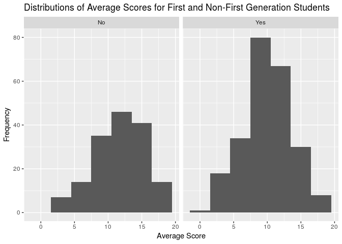
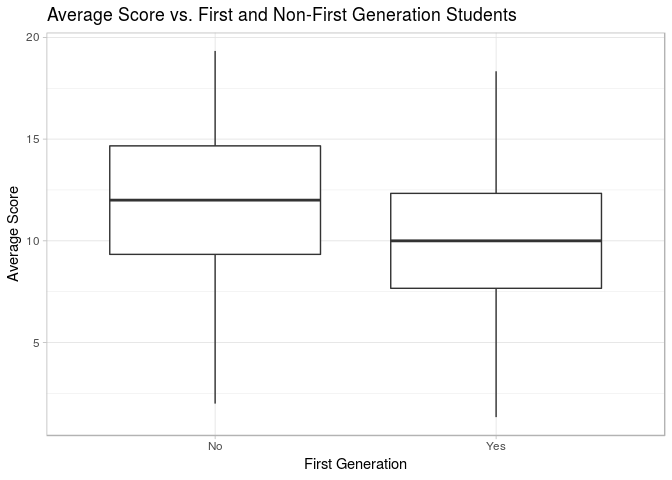
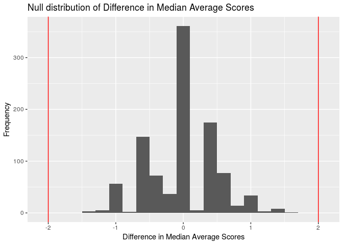

MATH IS FUN IF YOU ANALYZE IT RIGHT\!
================
LAW students
Mar. 29th

### Load packages

``` r
library(tidyverse)
library(broom)
library(infer)
```

### Load data

``` r
students <- read_csv("/cloud/project/data/student-mat.csv")
```

## Section 1. Introduction

For this project, we want to examine which characteristics are the best
predictors of high school students’ academic achievement. Specifically,
we are studying the effects of demographics, social, school, and family
related features on Portuguese secondary students’ final Mathematics
grades.

The data shows student achievement in secondary education of two
Portuguese schools, and was collected in November 2014 using school
reports and questionnaires. The dataset comes from the UCI Machine
Learning Repository, with a total of 395 observations and 33 variables.
We chose the Mathematics data set, which measures student achievement in
the subject of Mathematics.

The variables in the data set are: school, sex, age, address, famsize,
Pstatus, Medu, Fedu, Mjob (mother’s job), Fjob (father’s job), reason
(reason to choose this school), guardian, traveltime(home to school
travel time), studytime, failures (number of past class failures),
schoolsup (education), famsup, paid, activities, nursery, higher,
internet, romantic, famrel, freetime, goout, Dalc, Walc, health,
absences, G1 (first period grade), G2 (second period grade), G3 (final
grade)

From this data, we have formulated a general research question: Using
this data from the UCI Machine Learning Repository, what are the best
predictors of high Mathematics achievement in first generation v.
non-first generation secondary school students in Portuguese schools?

## Section 2. Data analysis plan

Since we want to study the effect of certain variables on student
achievement, the outcome (response) variable will be the student’s
overall average grade. For the outcome variable, we created a new
numeric variable called `avg_score` that takes the average of G1, G2,
and G3, which corresponds to the term1, term2, and final grades of the
students. The predictor (explanatory) variables will be the four
variables with the highest difference in mean/median/proportion between
first and non-first generation students. We will choose these variables
out of the 13 selected variables from the optimal multiple linear
regression model we found by conducting a model selection of the full
model.

``` r
students <- students %>%
  mutate(avg_score = ((G1 + G2 + G3)/3))
```

``` r
students <- students %>%
  mutate(first_gen = case_when(
    Medu < 4 & Fedu < 4 ~ "Yes",
    TRUE ~ "No"))
students %>%
  count(first_gen)
```

    ## # A tibble: 2 x 2
    ##   first_gen     n
    ##   <chr>     <int>
    ## 1 No          157
    ## 2 Yes         238

``` r
full_model <- lm(avg_score ~ school +
                  sex + age + address +
                  famsize + Pstatus +
                   Mjob + Fjob +
                  reason + guardian + traveltime +
                  studytime + failures +
                  paid + activities +
                  nursery + higher + internet +
                  romantic + famrel + freetime +
                  goout + Dalc + Walc +
                  health + absences + first_gen, data = students)
final_model <- step(full_model, direction = "backward")
```

    ## Start:  AIC=973.57
    ## avg_score ~ school + sex + age + address + famsize + Pstatus + 
    ##     Mjob + Fjob + reason + guardian + traveltime + studytime + 
    ##     failures + paid + activities + nursery + higher + internet + 
    ##     romantic + famrel + freetime + goout + Dalc + Walc + health + 
    ##     absences + first_gen
    ## 
    ##              Df Sum of Sq    RSS     AIC
    ## - reason      3     18.34 3870.1  969.45
    ## - guardian    2      7.96 3859.7  970.39
    ## - Fjob        4     49.44 3901.2  970.61
    ## - paid        1      0.21 3852.0  971.60
    ## - famrel      1      0.44 3852.2  971.62
    ## - Pstatus     1      0.55 3852.3  971.63
    ## - age         1      0.89 3852.7  971.67
    ## - nursery     1      1.26 3853.0  971.70
    ## - activities  1      3.17 3854.9  971.90
    ## - internet    1      6.31 3858.1  972.22
    ## - Walc        1      7.89 3859.7  972.38
    ## - Dalc        1      8.20 3860.0  972.41
    ## - school      1      8.27 3860.0  972.42
    ## - traveltime  1     10.06 3861.8  972.60
    ## - address     1     10.93 3862.7  972.69
    ## - absences    1     11.19 3863.0  972.72
    ## - freetime    1     17.22 3869.0  973.34
    ## - higher      1     18.75 3870.5  973.49
    ## <none>                    3851.8  973.57
    ## - health      1     25.16 3876.9  974.15
    ## - famsize     1     31.47 3883.2  974.79
    ## - romantic    1     34.67 3886.4  975.11
    ## - first_gen   1     50.09 3901.9  976.68
    ## - studytime   1     70.54 3922.3  978.74
    ## - Mjob        4    136.56 3988.3  979.34
    ## - goout       1     94.51 3946.3  981.15
    ## - sex         1    120.36 3972.1  983.73
    ## - failures    1    355.32 4207.1 1006.43
    ## 
    ## Step:  AIC=969.45
    ## avg_score ~ school + sex + age + address + famsize + Pstatus + 
    ##     Mjob + Fjob + guardian + traveltime + studytime + failures + 
    ##     paid + activities + nursery + higher + internet + romantic + 
    ##     famrel + freetime + goout + Dalc + Walc + health + absences + 
    ##     first_gen
    ## 
    ##              Df Sum of Sq    RSS     AIC
    ## - guardian    2      8.75 3878.9  966.34
    ## - Fjob        4     53.32 3923.4  966.86
    ## - paid        1      0.00 3870.1  967.45
    ## - Pstatus     1      0.46 3870.6  967.50
    ## - famrel      1      0.52 3870.6  967.50
    ## - nursery     1      0.91 3871.0  967.54
    ## - age         1      0.95 3871.1  967.55
    ## - activities  1      1.68 3871.8  967.62
    ## - internet    1      6.13 3876.2  968.08
    ## - Dalc        1      7.51 3877.6  968.22
    ## - school      1      7.99 3878.1  968.26
    ## - Walc        1      8.43 3878.5  968.31
    ## - address     1      8.95 3879.1  968.36
    ## - traveltime  1     11.66 3881.8  968.64
    ## - absences    1     14.58 3884.7  968.94
    ## - freetime    1     16.98 3887.1  969.18
    ## - higher      1     17.46 3887.6  969.23
    ## <none>                    3870.1  969.45
    ## - famsize     1     30.59 3900.7  970.56
    ## - romantic    1     33.87 3904.0  970.89
    ## - health      1     33.91 3904.0  970.90
    ## - first_gen   1     47.44 3917.5  972.26
    ## - studytime   1     74.75 3944.9  975.01
    ## - Mjob        4    155.32 4025.4  976.99
    ## - goout       1    100.66 3970.8  977.59
    ## - sex         1    118.33 3988.4  979.35
    ## - failures    1    365.72 4235.8 1003.12
    ## 
    ## Step:  AIC=966.34
    ## avg_score ~ school + sex + age + address + famsize + Pstatus + 
    ##     Mjob + Fjob + traveltime + studytime + failures + paid + 
    ##     activities + nursery + higher + internet + romantic + famrel + 
    ##     freetime + goout + Dalc + Walc + health + absences + first_gen
    ## 
    ##              Df Sum of Sq    RSS    AIC
    ## - Fjob        4     50.89 3929.7 963.49
    ## - age         1      0.01 3878.9 964.34
    ## - paid        1      0.03 3878.9 964.35
    ## - famrel      1      0.61 3879.5 964.40
    ## - Pstatus     1      0.91 3879.8 964.44
    ## - activities  1      1.73 3880.6 964.52
    ## - nursery     1      2.05 3880.9 964.55
    ## - internet    1      5.58 3884.4 964.91
    ## - school      1      6.52 3885.4 965.01
    ## - Walc        1      6.59 3885.4 965.01
    ## - Dalc        1      6.83 3885.7 965.04
    ## - traveltime  1     10.45 3889.3 965.40
    ## - address     1     10.71 3889.6 965.43
    ## - absences    1     17.02 3895.9 966.07
    ## - freetime    1     19.68 3898.5 966.34
    ## <none>                    3878.9 966.34
    ## - higher      1     21.33 3900.2 966.51
    ## - famsize     1     29.45 3908.3 967.33
    ## - romantic    1     31.90 3910.8 967.58
    ## - health      1     35.53 3914.4 967.94
    ## - first_gen   1     46.89 3925.7 969.09
    ## - studytime   1     76.82 3955.7 972.09
    ## - Mjob        4    155.72 4034.6 973.89
    ## - goout       1    106.13 3985.0 975.00
    ## - sex         1    118.24 3997.1 976.20
    ## - failures    1    360.84 4239.7 999.48
    ## 
    ## Step:  AIC=963.49
    ## avg_score ~ school + sex + age + address + famsize + Pstatus + 
    ##     Mjob + traveltime + studytime + failures + paid + activities + 
    ##     nursery + higher + internet + romantic + famrel + freetime + 
    ##     goout + Dalc + Walc + health + absences + first_gen
    ## 
    ##              Df Sum of Sq    RSS    AIC
    ## - age         1      0.00 3929.7 961.49
    ## - famrel      1      0.08 3929.8 961.50
    ## - paid        1      0.31 3930.0 961.52
    ## - Pstatus     1      1.32 3931.1 961.62
    ## - nursery     1      1.59 3931.3 961.65
    ## - activities  1      2.40 3932.1 961.73
    ## - Walc        1      2.52 3932.3 961.74
    ## - Dalc        1      3.24 3933.0 961.82
    ## - internet    1      4.37 3934.1 961.93
    ## - school      1      7.36 3937.1 962.23
    ## - traveltime  1     11.04 3940.8 962.60
    ## - address     1     11.45 3941.2 962.64
    ## - absences    1     15.35 3945.1 963.03
    ## - freetime    1     18.31 3948.1 963.33
    ## - higher      1     19.75 3949.5 963.47
    ## <none>                    3929.7 963.49
    ## - famsize     1     23.85 3953.6 963.88
    ## - romantic    1     27.76 3957.5 964.27
    ## - health      1     34.86 3964.6 964.98
    ## - studytime   1     72.92 4002.7 968.75
    ## - first_gen   1     74.20 4003.9 968.88
    ## - Mjob        4    153.11 4082.9 970.59
    ## - goout       1    103.71 4033.5 971.78
    ## - sex         1    116.87 4046.6 973.07
    ## - failures    1    366.72 4296.5 996.73
    ## 
    ## Step:  AIC=961.49
    ## avg_score ~ school + sex + address + famsize + Pstatus + Mjob + 
    ##     traveltime + studytime + failures + paid + activities + nursery + 
    ##     higher + internet + romantic + famrel + freetime + goout + 
    ##     Dalc + Walc + health + absences + first_gen
    ## 
    ##              Df Sum of Sq    RSS    AIC
    ## - famrel      1      0.08 3929.8 959.50
    ## - paid        1      0.31 3930.0 959.52
    ## - Pstatus     1      1.32 3931.1 959.62
    ## - nursery     1      1.60 3931.3 959.65
    ## - activities  1      2.40 3932.1 959.73
    ## - Walc        1      2.52 3932.3 959.74
    ## - Dalc        1      3.25 3933.0 959.82
    ## - internet    1      4.42 3934.2 959.93
    ## - school      1      8.49 3938.2 960.34
    ## - traveltime  1     11.10 3940.8 960.60
    ## - address     1     11.46 3941.2 960.64
    ## - absences    1     16.00 3945.7 961.09
    ## - freetime    1     18.34 3948.1 961.33
    ## <none>                    3929.7 961.49
    ## - higher      1     20.17 3949.9 961.51
    ## - famsize     1     23.85 3953.6 961.88
    ## - romantic    1     28.21 3958.0 962.32
    ## - health      1     35.06 3964.8 963.00
    ## - studytime   1     73.60 4003.3 966.82
    ## - first_gen   1     74.97 4004.7 966.95
    ## - Mjob        4    153.18 4082.9 968.59
    ## - goout       1    105.09 4034.8 969.91
    ## - sex         1    116.87 4046.6 971.07
    ## - failures    1    375.76 4305.5 995.56
    ## 
    ## Step:  AIC=959.5
    ## avg_score ~ school + sex + address + famsize + Pstatus + Mjob + 
    ##     traveltime + studytime + failures + paid + activities + nursery + 
    ##     higher + internet + romantic + freetime + goout + Dalc + 
    ##     Walc + health + absences + first_gen
    ## 
    ##              Df Sum of Sq    RSS    AIC
    ## - paid        1      0.29 3930.1 957.53
    ## - Pstatus     1      1.31 3931.1 957.63
    ## - nursery     1      1.61 3931.4 957.66
    ## - activities  1      2.40 3932.2 957.74
    ## - Walc        1      2.45 3932.3 957.74
    ## - Dalc        1      3.29 3933.1 957.83
    ## - internet    1      4.47 3934.3 957.95
    ## - school      1      8.45 3938.3 958.35
    ## - traveltime  1     11.09 3940.9 958.61
    ## - address     1     11.42 3941.2 958.64
    ## - absences    1     16.00 3945.8 959.10
    ## - freetime    1     19.01 3948.8 959.40
    ## <none>                    3929.8 959.50
    ## - higher      1     20.20 3950.0 959.52
    ## - famsize     1     23.86 3953.7 959.89
    ## - romantic    1     28.46 3958.3 960.35
    ## - health      1     35.09 3964.9 961.01
    ## - studytime   1     73.78 4003.6 964.84
    ## - first_gen   1     74.91 4004.7 964.96
    ## - Mjob        4    153.21 4083.0 966.61
    ## - goout       1    105.60 4035.4 967.97
    ## - sex         1    117.89 4047.7 969.17
    ## - failures    1    377.04 4306.9 993.69
    ## 
    ## Step:  AIC=957.53
    ## avg_score ~ school + sex + address + famsize + Pstatus + Mjob + 
    ##     traveltime + studytime + failures + activities + nursery + 
    ##     higher + internet + romantic + freetime + goout + Dalc + 
    ##     Walc + health + absences + first_gen
    ## 
    ##              Df Sum of Sq    RSS    AIC
    ## - Pstatus     1      1.39 3931.5 955.67
    ## - nursery     1      1.73 3931.8 955.70
    ## - Walc        1      2.31 3932.4 955.76
    ## - activities  1      2.32 3932.4 955.76
    ## - Dalc        1      3.45 3933.6 955.87
    ## - internet    1      4.28 3934.4 955.96
    ## - school      1      8.41 3938.5 956.37
    ## - traveltime  1     11.01 3941.1 956.63
    ## - address     1     11.38 3941.5 956.67
    ## - absences    1     16.05 3946.2 957.14
    ## - freetime    1     19.23 3949.3 957.46
    ## - higher      1     19.90 3950.0 957.52
    ## <none>                    3930.1 957.53
    ## - famsize     1     24.07 3954.2 957.94
    ## - romantic    1     28.55 3958.7 958.39
    ## - health      1     34.83 3964.9 959.01
    ## - studytime   1     73.65 4003.8 962.86
    ## - first_gen   1     74.98 4005.1 962.99
    ## - Mjob        4    153.05 4083.2 964.62
    ## - goout       1    105.38 4035.5 965.98
    ## - sex         1    120.89 4051.0 967.49
    ## - failures    1    379.65 4309.8 991.95
    ## 
    ## Step:  AIC=955.67
    ## avg_score ~ school + sex + address + famsize + Mjob + traveltime + 
    ##     studytime + failures + activities + nursery + higher + internet + 
    ##     romantic + freetime + goout + Dalc + Walc + health + absences + 
    ##     first_gen
    ## 
    ##              Df Sum of Sq    RSS    AIC
    ## - nursery     1      1.59 3933.1 953.83
    ## - Walc        1      2.20 3933.7 953.89
    ## - activities  1      2.74 3934.2 953.94
    ## - Dalc        1      3.32 3934.8 954.00
    ## - internet    1      3.81 3935.3 954.05
    ## - school      1      8.10 3939.6 954.48
    ## - traveltime  1     11.14 3942.6 954.78
    ## - address     1     11.50 3943.0 954.82
    ## - absences    1     17.50 3949.0 955.42
    ## - freetime    1     19.02 3950.5 955.57
    ## <none>                    3931.5 955.67
    ## - higher      1     20.36 3951.9 955.71
    ## - famsize     1     26.39 3957.9 956.31
    ## - romantic    1     28.26 3959.8 956.50
    ## - health      1     35.23 3966.7 957.19
    ## - studytime   1     73.36 4004.9 960.97
    ## - first_gen   1     78.19 4009.7 961.45
    ## - Mjob        4    154.46 4086.0 962.89
    ## - goout       1    105.29 4036.8 964.11
    ## - sex         1    120.79 4052.3 965.62
    ## - failures    1    378.86 4310.4 990.01
    ## 
    ## Step:  AIC=953.83
    ## avg_score ~ school + sex + address + famsize + Mjob + traveltime + 
    ##     studytime + failures + activities + higher + internet + romantic + 
    ##     freetime + goout + Dalc + Walc + health + absences + first_gen
    ## 
    ##              Df Sum of Sq    RSS    AIC
    ## - Walc        1      2.45 3935.5 952.07
    ## - activities  1      2.54 3935.6 952.08
    ## - Dalc        1      3.18 3936.3 952.15
    ## - internet    1      4.09 3937.2 952.24
    ## - school      1      8.63 3941.7 952.69
    ## - traveltime  1     11.35 3944.4 952.96
    ## - address     1     11.44 3944.5 952.97
    ## - absences    1     17.17 3950.3 953.55
    ## - freetime    1     19.16 3952.3 953.75
    ## <none>                    3933.1 953.83
    ## - higher      1     20.33 3953.4 953.86
    ## - famsize     1     25.27 3958.4 954.36
    ## - romantic    1     28.66 3961.7 954.69
    ## - health      1     35.04 3968.1 955.33
    ## - studytime   1     72.34 4005.4 959.03
    ## - first_gen   1     76.63 4009.7 959.45
    ## - Mjob        4    153.54 4086.6 960.95
    ## - goout       1    106.83 4039.9 962.41
    ## - sex         1    120.12 4053.2 963.71
    ## - failures    1    377.45 4310.5 988.02
    ## 
    ## Step:  AIC=952.07
    ## avg_score ~ school + sex + address + famsize + Mjob + traveltime + 
    ##     studytime + failures + activities + higher + internet + romantic + 
    ##     freetime + goout + Dalc + health + absences + first_gen
    ## 
    ##              Df Sum of Sq    RSS    AIC
    ## - Dalc        1      1.19 3936.7 950.19
    ## - activities  1      2.60 3938.1 950.33
    ## - internet    1      4.09 3939.6 950.48
    ## - school      1      8.39 3943.9 950.91
    ## - address     1     10.66 3946.2 951.14
    ## - traveltime  1     11.17 3946.7 951.19
    ## - freetime    1     18.01 3953.6 951.88
    ## - absences    1     18.53 3954.1 951.93
    ## <none>                    3935.5 952.07
    ## - higher      1     20.22 3955.8 952.10
    ## - famsize     1     25.99 3961.5 952.67
    ## - romantic    1     28.99 3964.5 952.97
    ## - health      1     34.12 3969.7 953.48
    ## - studytime   1     70.08 4005.6 957.04
    ## - first_gen   1     74.83 4010.4 957.51
    ## - Mjob        4    155.23 4090.8 959.35
    ## - goout       1    109.86 4045.4 960.95
    ## - sex         1    126.34 4061.9 962.55
    ## - failures    1    377.96 4313.5 986.30
    ## 
    ## Step:  AIC=950.19
    ## avg_score ~ school + sex + address + famsize + Mjob + traveltime + 
    ##     studytime + failures + activities + higher + internet + romantic + 
    ##     freetime + goout + health + absences + first_gen
    ## 
    ##              Df Sum of Sq    RSS    AIC
    ## - activities  1      2.27 3939.0 948.42
    ## - internet    1      3.89 3940.6 948.58
    ## - school      1      7.99 3944.7 948.99
    ## - address     1     11.24 3948.0 949.32
    ## - traveltime  1     11.74 3948.5 949.37
    ## - freetime    1     17.30 3954.0 949.92
    ## - absences    1     17.69 3954.4 949.96
    ## - higher      1     19.90 3956.6 950.18
    ## <none>                    3936.7 950.19
    ## - famsize     1     25.32 3962.0 950.72
    ## - romantic    1     29.13 3965.9 951.10
    ## - health      1     34.86 3971.6 951.67
    ## - studytime   1     71.76 4008.5 955.33
    ## - first_gen   1     74.38 4011.1 955.58
    ## - Mjob        4    156.35 4093.1 957.58
    ## - goout       1    121.03 4057.8 960.15
    ## - sex         1    126.56 4063.3 960.69
    ## - failures    1    382.19 4318.9 984.79
    ## 
    ## Step:  AIC=948.42
    ## avg_score ~ school + sex + address + famsize + Mjob + traveltime + 
    ##     studytime + failures + higher + internet + romantic + freetime + 
    ##     goout + health + absences + first_gen
    ## 
    ##              Df Sum of Sq    RSS    AIC
    ## - internet    1      3.83 3942.8 946.80
    ## - school      1      9.22 3948.2 947.34
    ## - traveltime  1     11.89 3950.9 947.61
    ## - address     1     12.32 3951.3 947.65
    ## - freetime    1     16.48 3955.5 948.07
    ## - absences    1     17.85 3956.8 948.21
    ## - higher      1     18.92 3957.9 948.31
    ## <none>                    3939.0 948.42
    ## - famsize     1     25.30 3964.3 948.95
    ## - romantic    1     30.04 3969.0 949.42
    ## - health      1     34.82 3973.8 949.90
    ## - studytime   1     70.01 4009.0 953.38
    ## - first_gen   1     73.47 4012.5 953.72
    ## - Mjob        4    155.76 4094.8 955.74
    ## - goout       1    122.24 4061.2 958.49
    ## - sex         1    124.42 4063.4 958.70
    ## - failures    1    380.79 4319.8 982.87
    ## 
    ## Step:  AIC=946.8
    ## avg_score ~ school + sex + address + famsize + Mjob + traveltime + 
    ##     studytime + failures + higher + romantic + freetime + goout + 
    ##     health + absences + first_gen
    ## 
    ##              Df Sum of Sq    RSS    AIC
    ## - school      1      8.57 3951.4 945.66
    ## - traveltime  1     11.83 3954.7 945.99
    ## - address     1     14.82 3957.7 946.29
    ## - freetime    1     16.89 3959.7 946.49
    ## - higher      1     18.52 3961.4 946.65
    ## - absences    1     19.54 3962.4 946.76
    ## <none>                    3942.8 946.80
    ## - famsize     1     24.64 3967.5 947.26
    ## - romantic    1     28.32 3971.2 947.63
    ## - health      1     37.74 3980.6 948.57
    ## - studytime   1     72.86 4015.7 952.04
    ## - first_gen   1     74.23 4017.1 952.17
    ## - Mjob        4    158.78 4101.6 954.40
    ## - goout       1    120.52 4063.4 956.70
    ## - sex         1    126.85 4069.7 957.31
    ## - failures    1    383.89 4326.7 981.50
    ## 
    ## Step:  AIC=945.66
    ## avg_score ~ sex + address + famsize + Mjob + traveltime + studytime + 
    ##     failures + higher + romantic + freetime + goout + health + 
    ##     absences + first_gen
    ## 
    ##              Df Sum of Sq    RSS    AIC
    ## - traveltime  1      9.34 3960.7 944.59
    ## - address     1     10.56 3962.0 944.72
    ## - absences    1     16.70 3968.1 945.33
    ## - freetime    1     17.93 3969.3 945.45
    ## - higher      1     19.12 3970.5 945.57
    ## <none>                    3951.4 945.66
    ## - romantic    1     25.91 3977.3 946.24
    ## - famsize     1     26.91 3978.3 946.34
    ## - health      1     40.11 3991.5 947.65
    ## - studytime   1     68.42 4019.8 950.44
    ## - first_gen   1     71.05 4022.5 950.70
    ## - Mjob        4    156.09 4107.5 952.97
    ## - goout       1    120.64 4072.0 955.54
    ## - sex         1    123.10 4074.5 955.78
    ## - failures    1    382.90 4334.3 980.20
    ## 
    ## Step:  AIC=944.59
    ## avg_score ~ sex + address + famsize + Mjob + studytime + failures + 
    ##     higher + romantic + freetime + goout + health + absences + 
    ##     first_gen
    ## 
    ##             Df Sum of Sq    RSS    AIC
    ## - absences   1     17.77 3978.5 944.36
    ## - freetime   1     19.00 3979.7 944.48
    ## - address    1     19.56 3980.3 944.54
    ## - higher     1     19.60 3980.3 944.54
    ## <none>                   3960.7 944.59
    ## - famsize    1     24.39 3985.1 945.02
    ## - romantic   1     26.85 3987.6 945.26
    ## - health     1     40.03 4000.8 946.57
    ## - first_gen  1     72.06 4032.8 949.72
    ## - studytime  1     73.78 4034.5 949.88
    ## - Mjob       4    161.30 4122.0 952.36
    ## - sex        1    120.99 4081.7 954.48
    ## - goout      1    124.95 4085.7 954.86
    ## - failures   1    386.64 4347.4 979.38
    ## 
    ## Step:  AIC=944.36
    ## avg_score ~ sex + address + famsize + Mjob + studytime + failures + 
    ##     higher + romantic + freetime + goout + health + first_gen
    ## 
    ##             Df Sum of Sq    RSS    AIC
    ## - freetime   1     16.47 3995.0 943.99
    ## - address    1     18.02 3996.5 944.15
    ## - higher     1     18.28 3996.8 944.17
    ## <none>                   3978.5 944.36
    ## - romantic   1     21.37 3999.9 944.48
    ## - famsize    1     25.71 4004.2 944.91
    ## - health     1     41.68 4020.2 946.48
    ## - studytime  1     68.10 4046.6 949.07
    ## - first_gen  1     71.80 4050.3 949.43
    ## - Mjob       4    158.68 4137.2 951.81
    ## - sex        1    114.18 4092.7 953.54
    ## - goout      1    119.67 4098.2 954.07
    ## - failures   1    382.48 4361.0 978.62
    ## 
    ## Step:  AIC=943.99
    ## avg_score ~ sex + address + famsize + Mjob + studytime + failures + 
    ##     higher + romantic + goout + health + first_gen
    ## 
    ##             Df Sum of Sq    RSS    AIC
    ## - higher     1     18.10 4013.1 943.78
    ## - address    1     18.79 4013.8 943.85
    ## <none>                   3995.0 943.99
    ## - romantic   1     21.01 4016.0 944.07
    ## - famsize    1     25.03 4020.0 944.46
    ## - health     1     39.46 4034.4 945.88
    ## - studytime  1     64.41 4059.4 948.31
    ## - first_gen  1     70.72 4065.7 948.93
    ## - Mjob       4    155.46 4150.4 951.07
    ## - goout      1    104.56 4099.5 952.20
    ## - sex        1    133.33 4128.3 954.96
    ## - failures   1    376.27 4371.3 977.55
    ## 
    ## Step:  AIC=943.78
    ## avg_score ~ sex + address + famsize + Mjob + studytime + failures + 
    ##     romantic + goout + health + first_gen
    ## 
    ##             Df Sum of Sq    RSS    AIC
    ## - address    1     18.55 4031.6 943.60
    ## <none>                   4013.1 943.78
    ## - famsize    1     25.72 4038.8 944.30
    ## - romantic   1     26.10 4039.2 944.34
    ## - health     1     38.36 4051.4 945.54
    ## - studytime  1     72.06 4085.1 948.81
    ## - first_gen  1     77.81 4090.9 949.36
    ## - Mjob       4    160.76 4173.8 951.29
    ## - goout      1    104.71 4117.8 951.95
    ## - sex        1    122.08 4135.2 953.62
    ## - failures   1    441.14 4454.2 982.97
    ## 
    ## Step:  AIC=943.6
    ## avg_score ~ sex + famsize + Mjob + studytime + failures + romantic + 
    ##     goout + health + first_gen
    ## 
    ##             Df Sum of Sq    RSS    AIC
    ## <none>                   4031.6 943.60
    ## - romantic   1     25.66 4057.3 944.11
    ## - famsize    1     28.63 4060.3 944.40
    ## - health     1     41.03 4072.7 945.60
    ## - studytime  1     69.11 4100.7 948.32
    ## - first_gen  1     78.87 4110.5 949.25
    ## - goout      1     99.25 4130.9 951.21
    ## - Mjob       4    175.48 4207.1 952.43
    ## - sex        1    116.85 4148.5 952.89
    ## - failures   1    457.36 4489.0 984.05

``` r
tidy(final_model) %>%
  select(term, estimate)
```

    ## # A tibble: 13 x 2
    ##    term         estimate
    ##    <chr>           <dbl>
    ##  1 (Intercept)   12.1   
    ##  2 sexM           1.19  
    ##  3 famsizeLE3     0.603 
    ##  4 Mjobhealth     1.63  
    ##  5 Mjobother      0.0578
    ##  6 Mjobservices   1.20  
    ##  7 Mjobteacher   -0.396 
    ##  8 studytime      0.534 
    ##  9 failures      -1.55  
    ## 10 romanticyes   -0.552 
    ## 11 goout         -0.458 
    ## 12 health        -0.237 
    ## 13 first_genYes  -1.15

We will be comparing achievement levels between first generation and
non-first generation Portuguese students. We classify non-first
generation students as those who have one or more parent with higher
education. To do this, we created a `first_gen` variable that labels
first generation students (those with both mothers and fathers who have
never attended higher education) as “yes” and non-first generation
students (those with at least one parent who received higher education )
as “no.” There are 238 observations for first generation students and
157 observations for non-first generation students.

We used model selection to select 13 variables as the most influential
on average student grade. We conducted backwards selection on the full
model to create a multiple linear regression model with these 13
variables.

avg\_score-hat = 12.10 + 1.19 \* sexM + 0.60 \* famsizeLE3 + 1.63 \*
Mjobhealth - 0.06 \* Mjobother + 1.20 \* Mjobservices - 0.40 \*
Mjobteacher + 0.53 \* studytime - 1.55 \* failures - 0.55 \* romanticyes
- 0.46 \* goout - 0.24 \* health - 1.15 \* first\_genYes

Linear regression modelling will be useful in helping us determine which
variables are most influential on student achievement, as well as give
us the slope and intercepts so we can quantify how influential each
variable is. This will help us choose the most influential variables on
average score. Then, we will use hypothesis testing to see if there are
statistically significant differences in means, medians, or proportions
in variables across first and non-first generation students. We will
take the top variables with the most significant differences to use as
our predictor variables. Then we will create correlation models using
linear regression to analyze the effect of differences in variables on
student achievement.

Bootstrapping will allow us to create confidence intervals that
represent how confident we are that our bootstrap distributions capture
the true population parameter. Sampling distributions will allow us to
find sample statistics that represent the population statistics. These
two methods will allow us to determine to what extent we can generalize
our findings to Portuguese students.

For our hypothesis tests, we would like to get p-values less than our
significance level of alpha = 0.05. This would allow us to conclude
there is a statistically significant difference in certain variables
between first generation and non-first generation students. After
determining which variables are statistically significant from each
other across the two groups, we would want to see those variables’
effects on average score. This would be shown through a linear
regression model with different slopes and intercepts for the two
groups.

We started our preliminary data analysis by creating a distribution for
average score for first generation and non-first generation students.
Because the distributions are slightly skewed, we decided to use median
and IQR as metrics of center and spread.

``` r
ggplot(data = students) +
  geom_histogram(mapping = aes(x = avg_score), binwidth = 3) +
  facet_wrap(~ first_gen) +
  labs(title = "Distributions of Average Scores for First and Non-First Generation Students",
          x = "Average Score", y = "Frequency")
```

<!-- -->

We compared first and non-first generation students’ average scores in a
boxplot diagram. The boxplot shows that, in this sample, the non-first
generation students’ median average score is 12, which is slightly
higher than the first generation students’ median average score of 10.
They have spreads with IQRs of around 4 to 5. There are no apparent
outliers in either group.

``` r
ggplot (students, mapping = aes(x = first_gen, y = avg_score)) +
  geom_boxplot() +
  labs(title = "Average Score vs. First and Non-First Generation Students",
       x = "First Generation",
       y = "Average Score") +
  theme_light()
```

<!-- -->

``` r
students %>%
  group_by(first_gen) %>%
  summarise (med=median(avg_score),
             IQR = IQR(avg_score))
```

    ## # A tibble: 2 x 3
    ##   first_gen   med   IQR
    ##   <chr>     <dbl> <dbl>
    ## 1 No           12  5.33
    ## 2 Yes          10  4.67

However, we want to determine whether this sample observation difference
of 2 between median average scores is due to chance or is actually
statistically significant. We conducted a hypothesis test for the
difference in median average scores between first generation and
non-first generation students.

Since we are comparing two variables, median average score of first
generation students and median average score of non-first generation
students, we use permute to generate a null distribution of the
difference in mean average scores.

``` r
avg_difference <- students %>%
                group_by(first_gen) %>%
  summarize(median = median (avg_score)) %>%
                summarize(diff(median)) %>%
  pull()
```

``` r
set.seed(2019)
null_students <- students %>%
  specify(response = avg_score, explanatory = first_gen) %>%
  hypothesize(null = "independence") %>%
  generate(1000, type = "permute") %>%
  calculate(stat = "diff in medians",
            order = c("No", "Yes"))
```

``` r
ggplot(data= null_students) +
  geom_histogram(mapping = aes(x = stat), binwidth = 0.2) +
  labs(title = "Null distribution of Difference in Median Average Scores",
       x = "Difference in Median Average Scores",
       y = "Frequency") +
  geom_vline(xintercept = avg_difference, color = "red") +
  geom_vline(xintercept = -avg_difference, color = "red")
```

<!-- -->

The p-value of 0 is less than the significance level alpha = 0.05. Thus,
we can state that there is a statistically significant difference
between the median average scores of first and non-first generation
students. This justifies our research question asking for the best
predictors of high math achievement. Since we have shown a difference in
median average scores between our comparison groups, we can evaluate how
our predictor variables affect first and non-first generation students’
mathematics scores differently.

``` r
null_students %>%
  filter(stat >= -avg_difference) %>%
  summarise(p_value = 2 * (n() / 1000))
```

    ## # A tibble: 1 x 1
    ##   p_value
    ##     <dbl>
    ## 1       0

## Section 3. Data

``` r
glimpse(students)
```

    ## Observations: 395
    ## Variables: 35
    ## $ school     <chr> "GP", "GP", "GP", "GP", "GP", "GP", "GP", "GP", "GP",…
    ## $ sex        <chr> "F", "F", "F", "F", "F", "M", "M", "F", "M", "M", "F"…
    ## $ age        <dbl> 18, 17, 15, 15, 16, 16, 16, 17, 15, 15, 15, 15, 15, 1…
    ## $ address    <chr> "U", "U", "U", "U", "U", "U", "U", "U", "U", "U", "U"…
    ## $ famsize    <chr> "GT3", "GT3", "LE3", "GT3", "GT3", "LE3", "LE3", "GT3…
    ## $ Pstatus    <chr> "A", "T", "T", "T", "T", "T", "T", "A", "A", "T", "T"…
    ## $ Medu       <dbl> 4, 1, 1, 4, 3, 4, 2, 4, 3, 3, 4, 2, 4, 4, 2, 4, 4, 3,…
    ## $ Fedu       <dbl> 4, 1, 1, 2, 3, 3, 2, 4, 2, 4, 4, 1, 4, 3, 2, 4, 4, 3,…
    ## $ Mjob       <chr> "at_home", "at_home", "at_home", "health", "other", "…
    ## $ Fjob       <chr> "teacher", "other", "other", "services", "other", "ot…
    ## $ reason     <chr> "course", "course", "other", "home", "home", "reputat…
    ## $ guardian   <chr> "mother", "father", "mother", "mother", "father", "mo…
    ## $ traveltime <dbl> 2, 1, 1, 1, 1, 1, 1, 2, 1, 1, 1, 3, 1, 2, 1, 1, 1, 3,…
    ## $ studytime  <dbl> 2, 2, 2, 3, 2, 2, 2, 2, 2, 2, 2, 3, 1, 2, 3, 1, 3, 2,…
    ## $ failures   <dbl> 0, 0, 3, 0, 0, 0, 0, 0, 0, 0, 0, 0, 0, 0, 0, 0, 0, 0,…
    ## $ schoolsup  <chr> "yes", "no", "yes", "no", "no", "no", "no", "yes", "n…
    ## $ famsup     <chr> "no", "yes", "no", "yes", "yes", "yes", "no", "yes", …
    ## $ paid       <chr> "no", "no", "yes", "yes", "yes", "yes", "no", "no", "…
    ## $ activities <chr> "no", "no", "no", "yes", "no", "yes", "no", "no", "no…
    ## $ nursery    <chr> "yes", "no", "yes", "yes", "yes", "yes", "yes", "yes"…
    ## $ higher     <chr> "yes", "yes", "yes", "yes", "yes", "yes", "yes", "yes…
    ## $ internet   <chr> "no", "yes", "yes", "yes", "no", "yes", "yes", "no", …
    ## $ romantic   <chr> "no", "no", "no", "yes", "no", "no", "no", "no", "no"…
    ## $ famrel     <dbl> 4, 5, 4, 3, 4, 5, 4, 4, 4, 5, 3, 5, 4, 5, 4, 4, 3, 5,…
    ## $ freetime   <dbl> 3, 3, 3, 2, 3, 4, 4, 1, 2, 5, 3, 2, 3, 4, 5, 4, 2, 3,…
    ## $ goout      <dbl> 4, 3, 2, 2, 2, 2, 4, 4, 2, 1, 3, 2, 3, 3, 2, 4, 3, 2,…
    ## $ Dalc       <dbl> 1, 1, 2, 1, 1, 1, 1, 1, 1, 1, 1, 1, 1, 1, 1, 1, 1, 1,…
    ## $ Walc       <dbl> 1, 1, 3, 1, 2, 2, 1, 1, 1, 1, 2, 1, 3, 2, 1, 2, 2, 1,…
    ## $ health     <dbl> 3, 3, 3, 5, 5, 5, 3, 1, 1, 5, 2, 4, 5, 3, 3, 2, 2, 4,…
    ## $ absences   <dbl> 6, 4, 10, 2, 4, 10, 0, 6, 0, 0, 0, 4, 2, 2, 0, 4, 6, …
    ## $ G1         <dbl> 5, 5, 7, 15, 6, 15, 12, 6, 16, 14, 10, 10, 14, 10, 14…
    ## $ G2         <dbl> 6, 5, 8, 14, 10, 15, 12, 5, 18, 15, 8, 12, 14, 10, 16…
    ## $ G3         <dbl> 6, 6, 10, 15, 10, 15, 11, 6, 19, 15, 9, 12, 14, 11, 1…
    ## $ avg_score  <dbl> 5.666667, 5.333333, 8.333333, 14.666667, 8.666667, 15…
    ## $ first_gen  <chr> "No", "Yes", "Yes", "No", "Yes", "No", "Yes", "No", "…

``` r
save(students, file = "/cloud/project/data/student-new.rdata")
```
